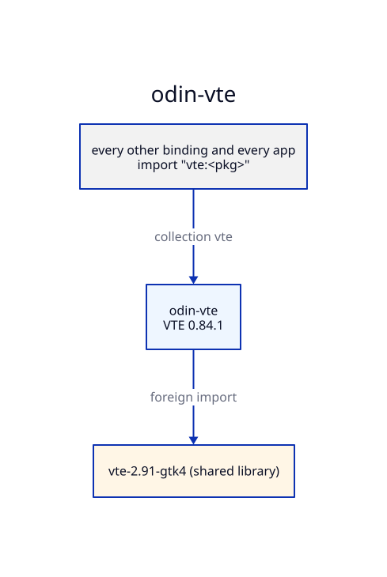

# Architecture — odin-vte

## Generation

`make generate` runs runic over each package's `rune.yml`. The headers are amber-vte/build/vte/stage/usr/include/vte-2.91-gtk4 (run `make vte` in amber-vte if missing).
`scripts/generate.sh` links `build/vte` to amber-vte's staged VTE tree, `build/gtk4` to
amber-gtk4's staged GTK tree and `build/sys` to `/`; `rune.yml` reaches headers through them.
`stdinc/` holds the libc stubs libclang needs. `scripts/postprocess.sh` then applies the rules
in [PATCHED.md](PATCHED.md). Regeneration is byte-for-byte reproducible.
The output is committed, so consumers need neither runic nor the headers to build.

## Patches

Where runic gets a signature wrong, the fix is a `rune.yml` setting or a `postprocess.sh` rule, listed in
[PATCHED.md](PATCHED.md), and pinned in `<pkg>/patched.odin` by a typed variable. A
regeneration that drops a patch then fails to compile.

## Collections

The collection `vte` points at this repo's root. Packages import their siblings and the
bindings below them through collections, never by relative path.

